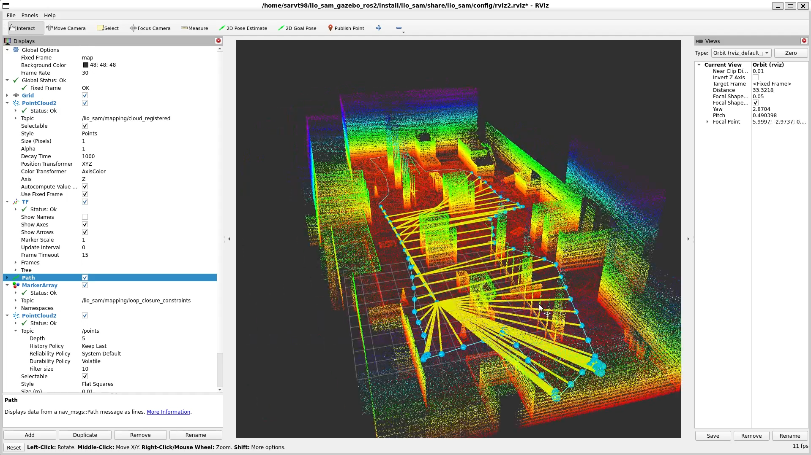
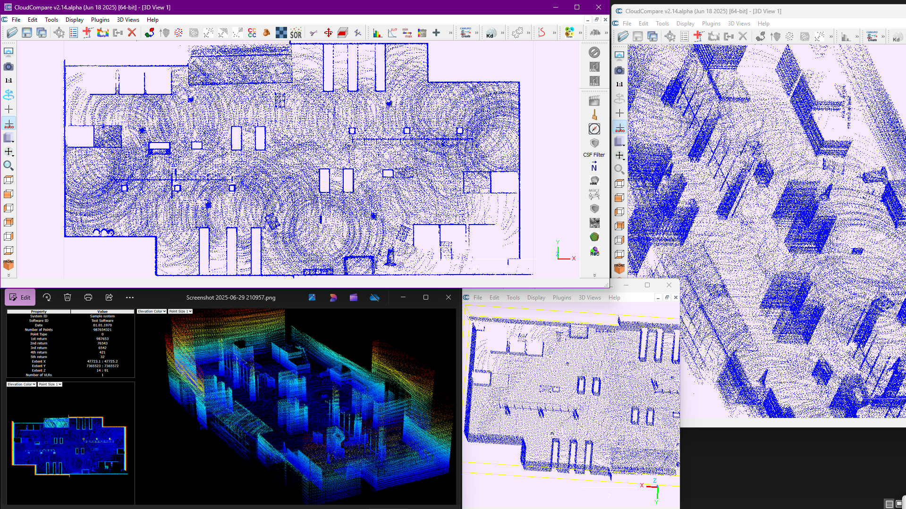
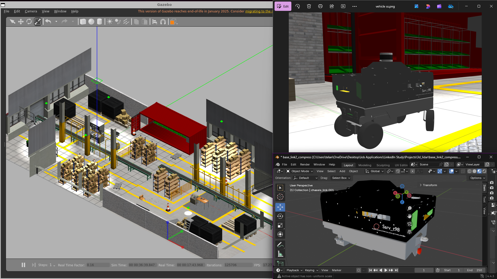

# Real-Time LiDAR SLAM Simulation with LIO-SAM in ROS 2 Humble using Gazebo and RViz2

<p align="center">
  <a href="https://www.apache.org/licenses/LICENSE-2.0">
    
  </a>
  
  
  
  
  
  
  
  
  
</p>

[](https://github.com/user-attachments/assets/194f1e06-5c52-43db-a424-8b3c177a9e14)




## Project Overview

This project demonstrates a real-time point cloud generation using LiDAR-SLAM (Simultaneous Localization and Mapping) algorithm - *LIO-SAM* in ROS 2 Humble. The simulation environment is built with Gazebo and visualized in RViz2. It uses a Velodyne LiDAR & IMU sensors with a customized 4-wheeled robot in a simulated factory world environment.

## What is LIO-SAM?

LIO-SAM is a framework designed for highly accurate, real-time trajectory estimation and map-building for mobile robots. It builds lidar-inertial odometry using a factor graph approach, enabling the integration of various relative and absolute measurements—such as loop closures—from multiple sources as factors within the system.

Refer to the documentation of LIO-SAM Algorithm through this repository:
https://github.com/TixiaoShan/LIO-SAM
---

## Prerequisites

Ensure you have the following installed:

- ROS 2 Humble
- Gazebo 11 (Classic or compatible)
- RViz2
- colcon (ROS 2 build tool)
- CloudCompare (for .pcd file visualization, optional)

---

## Build Instructions

1. Fork and clone this repository

2. Clone the following repositories into the `src/` folder of `lio_sam_gazebo_ros2`

### a]. LIO-SAM for ROS 2
- Repository: [https://github.com/TixiaoShan/LIO-SAM](https://github.com/TixiaoShan/LIO-SAM)
- Note: Replace the default `params.yaml` with the one provided in this repository.

### b]. Velodyne Simulator
- Repository: [https://github.com/ToyotaResearchInstitute/velodyne_simulator](https://github.com/ToyotaResearchInstitute/velodyne_simulator)

3. Create a build:

(Ensure all necessary dependencies are listed in the respective CMakeLists.txt files for each package in the src/ directory.)

```bash
cd lio_sam_gazebo_ros2

colcon build

(You could use `colcon build --parallel-workers 1` to limit memory usage)
```

4. IMP: Before launching the build, copy all files from `lio_sam_gazebo_ros2/models/factory_model/` (Gazebo models for the factory world) to your `/home/<user>/.gazebo/models/` directory

## Launch Instructions

1. 1st Terminal- Launch Gazebo Simulation
```bash
source lio_sam_gazebo_ros2/install/setup.bash

ros2 launch robot_gazebo robot_sim.launch.py
```
2. 2nd terminal
```bash
source lio_sam_gazebo_ros2/install/setup.bash

ros2 launch lio_sam run.launch.py
```

## Save Results

To save .pcd files make sure you have created directory for it in /home/<user>/Downloads/LOAM/
(see LIO-SAM-ros2/src/mapOptmization.cpp for more details.)

.pcd files can be analyzed with CloudCompare software or online LIDAR viewer tools.

## References
- LIO-SAM-ros2: https://github.com/TixiaoShan/LIO-SAM
- velodyne_simulator: https://github.com/ToyotaResearchInstitute/velodyne_simulator

- https://www.youtube.com/@robotmania8896: https://youtu.be/NNR9RUNz5Pg?si=Ex7P1nzOOn515r1_

This repo extends this to:
- Migration to ROS 2 Humble with necessary bug fixes
- Navigation using teleop_twist_keyboard in ros2 instead of joypad
- Customized robot model and improved world env
